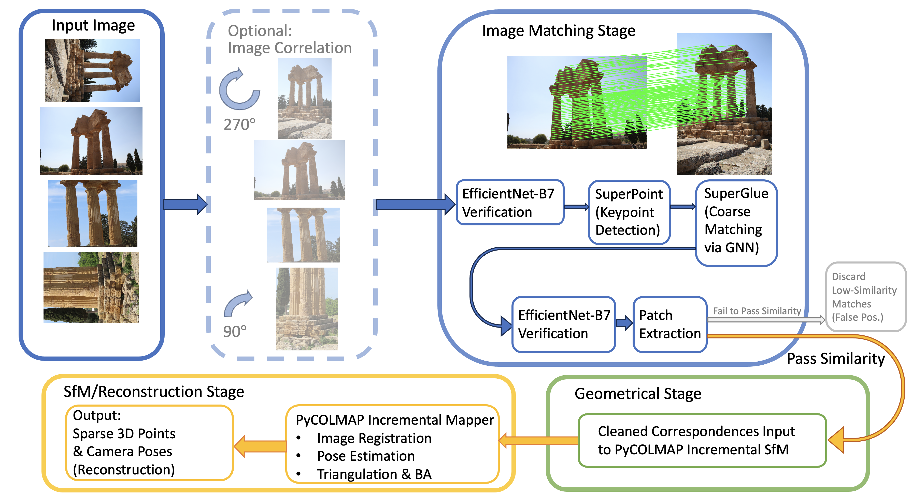
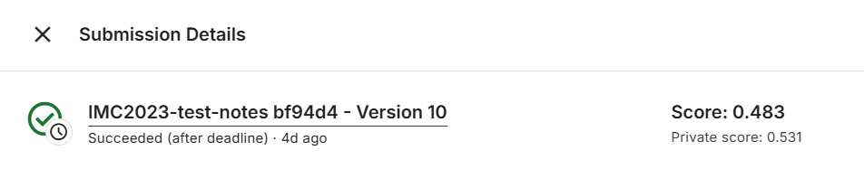

# VRDL Final Project: Image Matching Challenge 2023

## Team members
- 110550067 簡秉霖
- 110550165 何存益 
- 111550020 方漢霖 
- 110550085 房天越

## Task
- Target  
**Reconstruct accurate 3D maps** from images of various scenes taken from many different views.  

    Estimate the pose for each image in a set. Each camera pose is parameterized with **a rotation matrix** and **a translation vector**, from an arbitrary frame of reference.  

    The goal is to reach the highest **mean Average Accuracy (mAA)** of the estimated pose.  

## Rules and limitations
- CPU Notebook <= 9 hours run-time  

- GPU Notebook <= 9 hours run-time  
- Internet access disabled  
- Freely & publicly available **external data is allowed, including pre-trained models**  

## Dataset
- Roughly 1,100 images in the hidden test set. The number of images in a scene may vary from <10 to ~250.  

## Input file structure
```
/kaggle/input/image-matching-challenge-2023/
├── sample_submission.csv
└── test
    ├── haiper
    │   ├── bike
    │   ├── chairs
    │   └── fountain
    ├── heritage
    │   ├── cyprus
    │   ├── dioscuri
    │   └── wall
    ├── phototourism
    │   ├── LICENSE.txt
    │   ├── brandenburg_gate
    │   ├── british_museum
    │   ├── buckingham_palace
    │   ├── colosseum_exterior
    │   ├── grand_place_brussels
    │   ├── lincoln_memorial_statue
    │   ├── notre_dame_front_facade
    │   ├── pantheon_exterior
    │   ├── piazza_san_marco
    │   ├── sacre_coeur
    │   ├── sagrada_familia
    │   ├── st_pauls_cathedral
    │   ├── st_peters_square
    │   ├── taj_mahal
    │   ├── temple_nara_japan
    │   └── trevi_fountain
    ├── train_labels.csv
    └── urban
        └── kyiv-puppet-theater
```
- Another directory **/images** lies under each scene directory, which contains all the input images for that specific scene.  

- sample_submission.csv: a valid, randomly-generated sample submission with the following fields:
    - image_path: The image filename, including the path.
    
    - dataset: The unique identifier for the dataset.
    - scene: The unique identifier for the scene.
    - rotation_matrix: The first target column. A 
 matrix, flattened into a vector in row-major convection, with values separated by ;.
    - translation_vector: The second target column. A 3-D dimensional vector, with values separated by ;.

## Model architecture


## Result
